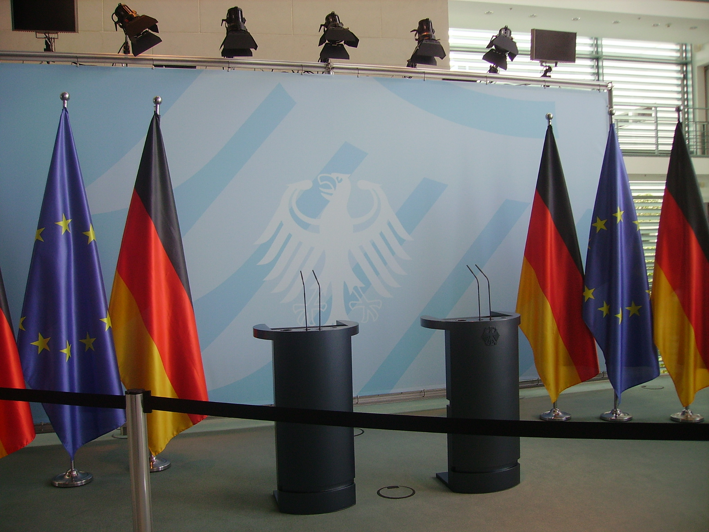

[Home](https://kostagav.github.io/) | [Research](https://kostagav.github.io/research) | [Projects](https://kostagav.github.io/projects) | [Contact](https://kostagav.github.io/contact)

## Projects

### Scraping and Pre-Processing Press Releases from Political Parties using Python

Press releases have been just recently been discovered as important source of information to determine the ideological positions of political parties and candidates. However, this data is often not preprocessed adequately and has to be extracted by researchers from the respective homepages of the political parties. In order to train my Python skills, I decided to write a Python script that automatically scrapes all press releases from the six big political parties in the German Bundestag. However, due to the particularities in the respective homepages (different relative paths, HTML and JavaScripted homepages), it is not possible to create a script running over all homepages at once. Since the press releases are still quite messy after scraping them, I supplement my code with some pre-processing steps in Python and create easy-to-use tsv-files from the scraped and pre-processed press releases.

Privacy disclaimer: Do not scrape homepages when you are unsure whether the Terms of Service do not provide permission to extract information automatically. To see the relevance of this problem, please read the following [blog entry](https://benbernardblog.com/web-scraping-and-crawling-are-perfectly-legal-right/). The author does not take any responsibilities when applying the code to any non-personal homepages.

CDU/CSU: [Code](https://github.com/KostaGav/KostaGav.github.io/tree/master/resources/cdu)

SPD: [Code](https://github.com/KostaGav/KostaGav.github.io/tree/master/resources/spd)

FDP: [Code](https://github.com/KostaGav/KostaGav.github.io/tree/master/resources/fdp)

Greens: [Code](https://github.com/KostaGav/KostaGav.github.io/tree/master/resources/greens)

The Left: [Code](https://github.com/KostaGav/KostaGav.github.io/tree/master/resources/left)

AfD: [Code](https://github.com/KostaGav/KostaGav.github.io/tree/master/resources/afd)

### Intro to Python at the CorrelAid Meet-Up in Hamburg

In 2017, I was pleased to participate at the CorrelAid Meet-Up in Hamburg. During this workshop, we welcomed several new members in our network and were able to develop new project ideas with four incredible NGOs from different fields of civil society. On the second day of our Meet-Up we launched several workshops in an open space session. I was invited to give a short introduction to Python and felt honored to give a two hour introduction to over 30 participants.

Since I believe that my code should be publicly available, please find my commented script (in German) [here](https://github.com/KostaGav/KostaGav.github.io/blob/master/resources/Python%20Skript%20Meet%20Up%20CorrelAid.ipynb). 

### CorrelAid Project with the Assocation of Debating Unions at Universities (Verband der Debattierclubs an Hochschulen)

From March to September 2016 I was the team leader of our CorrelAid project with the Association of Debating Unions at Universities (VDCH) and the German Debating Society (DDG). VDCH and DDG are committed to promote an active debating culture at German universities and asists students to develop their talents and skills. They asked us to develop and implement a member survey to get to know their members, their demands and wishes. Building on these results they aimed to sharpen their organisational and content profile. Together with four project members, we developed a survey from scratch, implemented it online, pre-tested it and launched it to the members of the VDCH and DDG. 

After data acquisition, we analyzed the results and developed a 90 pages full report on the results and implications from the survey, drafted a short report for the members and presented our results at the yearly full assembly of the VDCH. It was the first time that the debating unions received a full overview of their members and realized that their concept spread all over Germany, Austria and Switzerland. For me it was a great experience to coordinate a research team and generate scientific results which have a direct impact for civil society. I am also very proud on my project team, Mirka, Lisa, Thomas, and Fabienne, who did a great job during the project.

If you want to learn more about our project, please read the [interview](http://www.achteminute.de/20161012/der-gemeinnuetzige-aspekt-macht-viel-aus-konstantin-gavras-von-correlaid-im-interview/) I gave the VDCH, or read our short report [online](http://www.achteminute.de/wp-content/uploads/2016/10/DDG-VDCH-Debattierumfrage-2016-Kurzfassung.pdf).

### CorrelAid Pilot Project with the Boyscouts of Northern Germany (Pfadfinderbund Norddeutschland)
